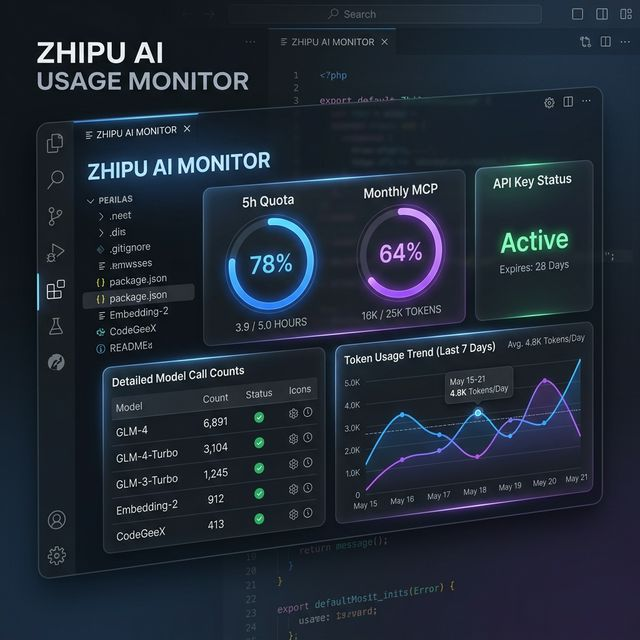

# 智谱 AI (GLM) 用量监控全家桶 🐾



本项目包含一套完整的智谱 AI (GLM) 使用量监控方案，支持 **VS Code 插件** 和 **Claude Code 终端状态栏**。

---

## 📺 效果展示

### 🖥️ Claude Code 终端三行显示 (仿真效果)
```text
🤖 Claude 3.5 Sonnet │ 📂 f:\zhipu
GLM │ Sess:0 │ Day:1.2k │ Mon:15.6k
5H ██████░░░░62% │ MCP ██░░░░░░27% │ ⏳ 0h45m
```
> *注：倒计时会根据剩余时间自动变色：🟢 >3h | 🟡 1-3h | 🔴 <1h*

---

## 📦 包含组件

### 1. VS Code 插件 (Zhipu Usage Monitor)
- **实时显示**：VS Code 状态栏实时显示 5 小时 Token 使用率。
- **详细面板**：点击状态栏弹出 Webview 面板，查看 24h 模型调用分布、Token 消耗排行及 MCP 额度。
- **自动告警**：用量过高时状态栏自动变色提醒。

### 2. Claude Code 终端脚本 (Combined StatusLine)
- **三行聚合**：专为 Claude Code 设计，在终端底部实时显示上下文、GLM 会话及配额。
- **实时倒计时**：提供精确的 GLM 5 小时配额重置倒计时 ⏳。
- **智能变色**：根据重置剩余时间自动切换颜色。

---

## 🚀 快速安装

### 第一步：VS Code 插件
1. 下载仓库中的 `zhipu-usage-monitor-0.1.0.vsix`。
2. 在 VS Code 中点击“扩展” -> “...” -> “从 VSIX 安装”。
3. 在设置中搜索 `zhipu.apiKey` 并填入你的智谱 API Key。

### 第二步：Claude Code 脚本 (可选)
1. 确保已安装系统级工具 `ccline` 和 `glm-coding-plan-statusline`。
2. 将 `combined-statusline.ps1` 放在本地固定位置。
3. 在 Claude Code 中执行以下配置指令：
   ```powershell
   claude config set TUI_STATUSLINE_COMMAND "powershell -NoProfile -ExecutionPolicy Bypass -File <你的绝对路径>\combined-statusline.ps1"
   ```

---

## 🛠️ 技术细节

- **API 驱动**：所有组件均直接对接智谱官方查询接口。
- **配置同步**：终端脚本会自动读取 VS Code 的 API Key 配置，无需重复设置。
- **兼容性**：完美支持 Windows 终端和编码环境。

## 📜 许可证

MIT | Created with Love 🐾
